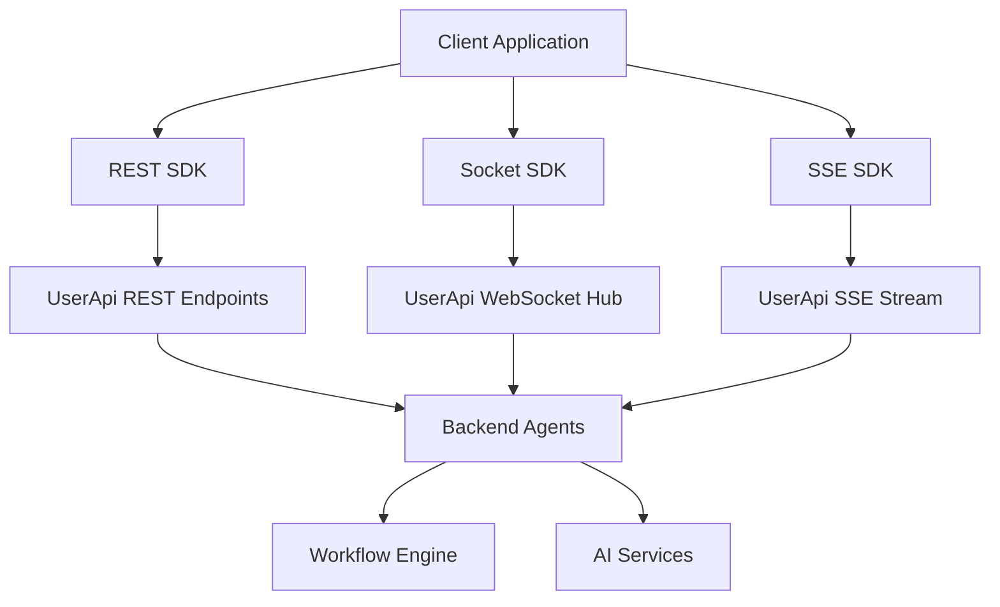

# XiansAi SDK Overview

## Purpose

The XiansAi SDK provides TypeScript clients for communicating with XiansAi backend agents. It enables applications to integrate AI-powered workflows, conversations, and data processing capabilities through multiple communication patterns.

## Architecture

The SDK is designed around **workflows** and **participants**, where:

- **Workflows**: Define the AI agent's behavior and processing logic
- **Participants**: Represent users, systems, or entities interacting with workflows
- **Messages**: Carry data between participants and workflows (Chat, Data, Handoff)

### Communication Patterns

The SDK offers three distinct communication patterns, each optimized for different use cases:



## SDK Components

### 1. REST SDK

**Best for**: Server-to-server communication, batch processing, synchronous workflows

- **Send**: Fire-and-forget message delivery
- **Converse**: Synchronous request-response conversations
- **History**: Retrieve conversation history
- **Authentication**: API key or JWT via Authorization header

### 2. Socket SDK (SignalR)

**Best for**: Interactive applications, real-time chat, bidirectional communication

- **Real-time messaging**: Instant message delivery
- **Event-driven**: React to agent responses immediately
- **Connection management**: Automatic reconnection and state management
- **Group subscriptions**: Subscribe to specific workflow notifications
- **Authentication**: API key via query params or JWT via headers

### 3. SSE SDK (Server-Sent Events)

**Best for**: Live notifications, status monitoring, one-way real-time updates

- **Event streaming**: Continuous server-to-client updates
- **Heartbeat monitoring**: Connection health checks
- **Automatic reconnection**: Resilient connection handling
- **Authentication**: API key recommended (JWT has browser limitations)

## Key Concepts

### Workflows

Workflows represent AI agents or automated processes. They are identified by:

- **Workflow ID**: Unique identifier for the workflow instance
- **Workflow Type**: Template or class of workflow behavior

### Participants

Participants represent entities interacting with workflows:

- **Participant ID**: Unique identifier for the participant
- **Scope**: Optional grouping or context for messages

### Message Flow

1. **Incoming Messages**: From participants to workflows
2. **Outgoing Messages**: From workflows to participants
3. **Message Types**: Chat (text), Data (structured), Handoff (control transfer)

## Authentication Methods

### API Key Authentication

- **Use case**: Server-to-server communication
- **Security**: Pre-shared secret
- **Implementation**: Query parameter or custom header
- **Pros**: Simple, reliable
- **Cons**: Shared secret management

### JWT Token Authentication

- **Use case**: Web applications, user-specific access
- **Security**: Signed tokens with expiration
- **Implementation**: Authorization Bearer header
- **Pros**: User context, expiration, revocation
- **Cons**: Token refresh complexity

## Choosing the Right SDK

### Decision Matrix

| Requirement | REST SDK | Socket SDK | SSE SDK |
|-------------|----------|------------|---------|
| Fire-and-forget messages | ✅ Best | ✅ Good | ❌ No |
| Synchronous conversations | ✅ Best | ✅ Good | ❌ No |
| Real-time notifications | ❌ No | ✅ Best | ✅ Best |
| Bidirectional communication | ❌ No | ✅ Best | ❌ No |
| Simple request/response | ✅ Best | ✅ Good | ❌ No |
| Event streaming | ❌ No | ✅ Good | ✅ Best |
| Server-to-server | ✅ Best | ✅ Good | ✅ Good |
| Web browser client | ✅ Good | ✅ Best | ✅ Good |
| Mobile applications | ✅ Best | ✅ Good | ✅ Good |

### Common Patterns

#### 1. Simple Automation

```typescript
// Use REST SDK for straightforward request-response
const restSDK = new RestSDK({ /* config */ });
const result = await restSDK.converse({
  workflow: 'document-processor',
  type: 'Data',
  participantId: 'system-01',
  data: { document: 'content...' }
});
```

#### 2. Interactive Chat

```typescript
// Use Socket SDK for real-time conversations
const socketSDK = new SocketSDK({
  eventHandlers: {
    onReceiveChat: (message) => {
      updateChatUI(message.text);
    }
  }
});
await socketSDK.connect();
await socketSDK.subscribeToAgent('customer-support', 'user-123');
```

#### 3. Status Monitoring

```typescript
// Use SSE SDK for live updates
const sseSDK = new SseSDK({
  eventHandlers: {
    onReceiveData: (message) => {
      updateStatusDisplay(message.data);
    }
  }
});
await sseSDK.connect({
  workflow: 'order-processing',
  participantId: 'order-456'
});
```

## Next Steps

- [Authentication Setup](./authentication.md) - Configure API keys or JWT tokens
- [Message Types](./message-types.md) - Understand Chat, Data, and Handoff messages
- [Quick Start Examples](./examples/quick-start.md) - Get started with each SDK 